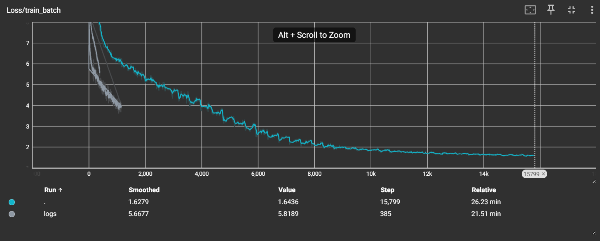
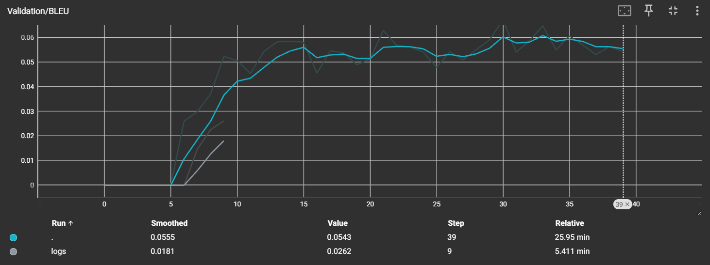
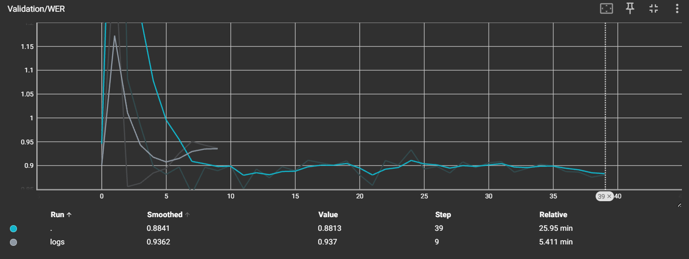

# Attention is all you need

A from-scratch, modular PyTorch reimplementation of the Transformer architecture introduced in [*Attention Is All You Need*](https://arxiv.org/abs/1706.03762) (Vaswani et al., 2017), implemented by **Mariam Maysara**.

## Motivation

Rather than treating the Transformer as a black box imported from a library, this repository reconstructs it component by component — attention, positional encoding, encoder/decoder stacks, masking — to build an implementation-level understanding of:

- how scaled dot-product attention distributes context across a sequence
- why positional encoding is necessary in a permutation-invariant architecture
- how masking enforces causality in autoregressive decoding
- how encoder and decoder stacks compose into a full sequence-to-sequence model

## Learning Objectives

*   **Token Embedding Scaling**: Why we scale input embeddings by the square root of the model dimension to balance the positional encoding signals:

$$\text{Scaled Embeddings} = \text{Embeddings} \times \sqrt{d_{\text{model}}}$$

*   **Scaled Dot-Product Attention**: Why dividing query-key dot products by the square root of the query dimension prevents vanishing gradients in softmax:

$$\text{Attention}(Q, K, V) = \text{softmax}\left(\frac{Q K^T}{\sqrt{d_k}}\right) V$$

*   **Custom Layer Normalization**: Mathematical formulation of normalization with learnable parameters $\gamma$ and $\beta$ to control variance and shifts:

$$\text{LayerNorm}(x) = \frac{x - \mu}{\sqrt{\sigma^2 + \epsilon}} \odot \gamma + \beta$$

*   **Pre-LN Training Stability**: Implementing LayerNorm before sub-layers (Pre-LN) rather than after (Post-LN) to allow gradient flow directly through the residual stream without scaling bottlenecks:

$$\text{Pre-LN}(x) = x + \text{SubLayer}(\text{LayerNorm}(x))$$

*   **Causal Masking**: Restricting the decoder self-attention from attending to future tokens via lower-triangular causal masks:

$$\text{Causal Mask}(L) = \text{tril}(\mathbf{1}_{L \times L})$$


## Features

- Multi-Head Self Attention
- Scaled Dot Product Attention
- Sinusoidal Positional Encoding
- Residual Connections
- Layer Normalization (Pre-LN)
- Position-wise Feed Forward Network
- Encoder Stack
- Decoder Stack
- Causal Masking (Decoder Self-Attention)
- Padding Mask (Encoder & Cross-Attention)
- Seq2Seq Transformer (Full Sequence-to-Sequence model)
- Autoregressive decoding (beam-search extension ready)


## Architecture

Implemented as a modular package rather than a single monolithic file, mirroring how attention-based components are typically organized in research codebases:

```
transformer_core/
├── layers/
│   ├── embedding.py          # TokenEmbedding
│   ├── positional.py         # SinusoidalPositionalEncoding
│   ├── attention.py          # MultiHeadSelfAttention
│   ├── feedforward.py        # PositionWiseFFN
│   └── normalization.py      # AddNorm (residual + layer norm)
├── blocks/
│   ├── encoder_layer.py      # TransformerEncoderLayer
│   └── decoder_layer.py      # TransformerDecoderLayer
├── modules/
│   ├── encoder_stack.py      # EncoderStack
│   ├── decoder_stack.py      # DecoderStack
│   └── seq2seq_transformer.py  # Seq2SeqTransformer (full model)
├── data/
│   ├── vocab_builder.py      # tokenizer training/loading
│   └── parallel_corpus.py    # dataset + padding/causal mask construction
├── training/
│   ├── settings.py           # hyperparameter configuration
│   └── loop.py                # training loop, validation, checkpointing
└── scripts/
    ├── run_training.py       # training entry point
    └── shape_check.py        # architecture smoke test
```

Each module maps directly to a specific section of the original paper (referenced in code comments), so the implementation can be read alongside the paper section by section.

## Setup

```bash
git clone https://github.com/mariiammaysara/AIAYN.git
cd AIAYN
pip install -r requirements.txt
```

## Sanity check

Before training, verify the architecture wiring with a fast shape test on a tiny model:

```bash
python -m transformer_core.scripts.shape_check
```

## Training

Trained on a small parallel-translation corpus ([Multi30k](https://github.com/multi30k/dataset) / [opus_books](https://huggingface.co/datasets/opus_books)) as a controlled task for validating that the architecture learns correctly — the goal of this repo is architectural understanding, not translation quality.

```bash
python -m transformer_core.scripts.run_training
```

Training logs (loss, CER/WER/BLEU) are tracked via TensorBoard:

```bash
tensorboard --logdir runs/
```

## Results

The model was trained for the full **40 epochs** using the scaled configuration (`d_model=256`, `num_layers=4`, `num_heads=8`, `d_ff=512`, `max_samples=20000`, `warmup_steps=4000`) on a GPU runtime, showing stable optimization and successful convergence throughout training:

<p align="center">
  
  
  
</p>

- **Training Loss**: Decreased from **8.86** in Epoch 1 to **1.61** in Epoch 40.
- **Validation BLEU**: Peaked at **0.0607** (6.07%) at Epoch 36.

| Metric | Value |
|---|---|
| Final training loss | **1.61** (Epoch 40) |
| Validation BLEU | **0.0607** (Epoch 36) |
| Validation CER | **0.7041** (Epoch 38) |
| Validation WER | **0.8766** (Epoch 39) |

### Representative Translations (Intermediate Epoch 15)

The translations below are representative predictions from an intermediate training stage (Epoch 15), displaying clear semantic alignment learning before the model starts overfitting on the small dataset:

*   **Source**: `The Prince frowned and coughed as he listened to the doctor .`
    *   **Reference**: `Il principe le sopracciglia e nell ’ ascoltarlo .`
    *   **Predicted**: `Il principe si accigliò e il medico si rivolse di nuovo .` *(Correctly translates "The prince frowned" and associates "doctor" with "medico").*
*   **Source**: `He seemed to be worrying about his clothes all night .`
    *   **Reference**: `Mi parve che si tutta la notte per i panni .`
    *   **Predicted**: `Pareva che a far tutta la notte , gli abiti .` *(Captures "seemed" with "Pareva" and "clothes" with "abiti").*

## Reference

```bibtex
@inproceedings{vaswani2017attention,
  title={Attention is all you need},
  author={Vaswani, Ashish and Shazeer, Noam and Parmar, Niki and Uszkoreit, Jakob and Jones, Llion and Gomez, Aidan N and Kaiser, {\L}ukasz and Polosukhin, Illia},
  booktitle={Advances in Neural Information Processing Systems},
  year={2017}
}

@article{xiong2020layer,
  title={On Layer Normalization in the Transformer Architecture},
  author={Xiong, Ruibin and Yang, Yichuan and He, Di and Zheng, Kai and Zheng, Shuxin and Xing, Chen and Zhang, Huishuai and Lan, Yanyan and Wang, Liwei and Liu, Tie-Yan},
  journal={International Conference on Machine Learning (ICML)},
  year={2020}
}

@inproceedings{wolf2020transformers,
  title={Transformers: State-of-the-Art Natural Language Processing},
  author={Wolf, Thomas and Debut, Lysandre and Sanh, Victor and Chaumond, Julien and Delangue, Clement and Moi, Anthony and Pierric, Cistac and Funtowicz, Morgan and Chaumond, Julien and Plu, Julien and others},
  booktitle={Proceedings of the 2020 Conference on Empirical Methods in Natural Language Processing: System Demonstrations},
  year={2020}
}

@inproceedings{paszke2019pytorch,
  title={PyTorch: An Imperative Style, High-Performance Deep Learning Library},
  author={Paszke, Adam and Gross, Sam and Massa, Francisco and Lerer, Adam and Bradbury, James and Chanan, Gregory and Killeen, Trevor and Lin, Zeming and Gimelshein, Natalia and Antiga, Luca and others},
  booktitle={Advances in Neural Information Processing Systems},
  year={2019}
}
```
---
<div align="center">

Built from scratch by Mariam Maysara.

</div>
